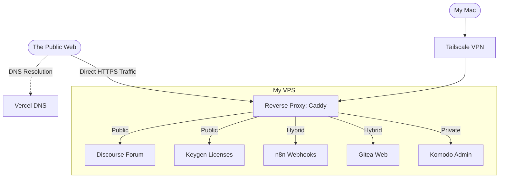

## Introduction
A few weeks ago at the time of writing this article, I launched into the development of Thence, a macOS application that remembers a developer's project context to save them time and energy when they resume it after a break.

The application code as such is only the tip of the iceberg. Very quickly, the reality on the ground catches up with you: to make a product live, you need a whole ecosystem around it. A space for the community, a software license management system, and internal tools to manage everything and make the right decisions for the product's evolution.

If we turn to all kinds of SaaS, each specializing in a particular task, with the versatility of the necessary systems, we can quickly find ourselves with a hefty bill. Being a student at that time, and having much better plans for my money, I made a radical decision: self-host as much as possible.

In this article, I invite you to explore the architecture of my VPS (Virtual Private Server). We will see how I managed to make public and private tools coexist on one and the same machine, the technical choices behind each brick, and how this "system D" (resourceful) approach allowed me to build a reliable, scalable, and available architecture, for not too much money.

## The Specifications: Leveraging Open Source
The goal was not to host services for the pleasure of testing them, but indeed to meet a real business need for Thence. For each need, I searched for and selected the best free, self-hostable solution in the best-case scenario, capable of running efficiently in Docker containers, without letting myself bury under technical debt.

### Code Hosting: Gitea
Goodbye GitHub or GitLab, I wanted to maintain the sovereignty of my code and manage my own CI/CD runners. Gitea is lightweight and does the job, so it stood out as an obvious choice.

### Automation: n8n
To manage my blog's RSS feeds and my newsletter, I needed a conductor. I had wanted to test n8n for a while, it was the perfect opportunity!

### Distribution and Licenses: Keygen
For a paid desktop application, software license management is the sinews of war. I needed a system capable of generating keys, managing activations, and ensuring that a user doesn't deploy the application on 10 different machines with a single subscription. I deployed the self-hosted version of Keygen for this.

### Support and Community: Discourse
Rather than opening a Discord server that is difficult for Google to index, or managing an unmanageable amount of customer support emails visible only to me, I chose Discourse. It's a forum, exposed to the Internet, which allows me to structure discussions with users, publish roadmaps, and exchange with the community around the application in general.

More precisely, I use it for several things at once:
* **Pre-registering users:** It is by inviting them to this forum in a dedicated group that I was able to find the beta users of the application, those with whom I am building the MVP (Minimum Viable Product), still at the time of writing this article.
* **Creating a public knowledge base self-fueled by users:** This is the second strong point of this kind of tool. People ask questions, I answer them, and other people who ask themselves the same questions read the discussions to find their answers. It is a self-fueled FAQ that answers users' questions directly, and not questions that I think users will ask.

### Deployment and Monitoring: Komodo
Deploying applications galore in Docker containers is good. But being able to do it graphically, monitor their health status, and perform their updates in a few clicks is better! Not that typing commands by hand particularly annoys me, on the contrary, but it's mostly tiring, longer. This is where Komodo comes in, my control center to manage the vast majority of my self-hosted applications serenely.

## The Core of the Problem: Making Public and Private Coexist
You may have noticed, I talked about services accessible to the public like Discourse, but also services that must imperatively remain private like Komodo or Keygen. That is why a good partitioning of the two (public and private) is necessary so as not to expose myself, and user data, to obvious and significant vulnerabilities. 

Here is how I secured and organized this traffic.

### Who Orchestrates the Traffic? The Vercel and Caddy Duo
One of the challenges when making several services cohabit on a single server is managing traffic and SSL certificates (HTTPS). In my architecture, I set up a cascading proxy system.

#### Public Traffic: Vercel at the DNS, Caddy at the Routing
For everything accessible by users (like the Discourse forum), the architecture is as follows: 

My main domain name is managed at Vercel. I declared a type A record there for public subdomains (for example `forum.thence.app`) pointing to the public IP of my VPS.

It is therefore my VPS that receives the connection. Once the request arrives, Caddy takes over. I chose Caddy, among other things, for its native Automatic HTTPS feature. It automatically provides and renews SSL certificates without my intervention. 

Here is an extract from my Caddyfile for the forum:

File successfully created: deploying-an-infrastructure-for-a-macos-app-distribution.md

```caddy
forum.thence.app {
        reverse_proxy 127.0.0.1:9080 {
                header_up Host {host}
                header_up X-Real-IP {remote_host}
                header_up X-Forwarded-For {remote_host}
                header_up X-Forwarded-Proto {scheme}
                header_up X-Forwarded-Host {host}
        }

        encode gzip zstd
}

```

No mention of certificates to manage, Caddy reads the request, manages HTTPS, transmits the correct headers so the application keeps the origin IP, and redirects the flow to the local port of my Discourse container.

#### Private Traffic: The Caddy + Tailscale Safe

For services that never need to be exposed to the public Web (like my Komodo administration interface), I applied the Zero Trust principle by combining Caddy and Tailscale. Out of the question for these flows to pass through the Internet or through Vercel.

Tailscale is a secure mesh VPN based on the WireGuard protocol. By installing Tailscale on my VPS and on my computers, my server gets a unique private IP address within my secure network (my tailnet).

For these services, the Caddy configuration adopts a totally closed approach:

```caddy
vps-939ea86a.tail8644df.ts.net {
    tls /etc/caddy/certs/cert.crt /etc/caddy/certs/cert.key
    reverse_proxy 127.0.0.1:9120
}

```

This block will never respond to a request on the Internet. It only listens on the private domain provided by Tailscale and uses locally generated certificates. If a robot scans my server's public IP, it will find absolutely nothing. To access my administration interface (here on local port 9120), I must imperatively activate Tailscale on my computer.

### Hybrid Cases: The Best of Both Worlds

#### Filtering by HTTP Route (The n8n Example)

Sometimes, a service must be partially public to receive data, but its administration interface must remain strictly inaccessible. This is the case for my n8n instance which must be able to receive webhooks from the outside.

Here is how I secure this flow:

```caddy
n8n.thence.app {
        @preflight {
                method OPTIONS
                path /webhook/*
        }

        handle @preflight {
                header Access-Control-Allow-Origin "[https://thence.app](https://thence.app)"
                header Access-Control-Allow-Methods "GET, POST, OPTIONS"
                header Access-Control-Allow-Headers "Content-Type, Authorization"
                header Access-Control-Max-Age "86400"
                respond "" 204
        }

        handle /webhook/* {
                header Access-Control-Allow-Origin "[https://thence.app](https://thence.app)"
                header Access-Control-Allow-Methods "GET, POST, OPTIONS"
                header Access-Control-Allow-Headers "Content-Type, Authorization"

                reverse_proxy [http://100.127.230.106:5678](http://100.127.230.106:5678)
        }

        handle {
                respond "Forbidden" 403
        }
}

```

Here, I handle:

* CORS "preflight" (OPTIONS) requests to authorize my main application to communicate with the API
* I authorize the reverse proxy only on the `/webhook/*` path
* The last handle block acts like an `else`: any other request will be returned a 403 Forbidden error. The tool can thus work serenely with the outside without ever exposing its back-office.

Here, I handle:

* CORS "preflight" (OPTIONS) requests to authorize my main application to communicate with the API
* I authorize the reverse proxy only on the `/webhook/*` path
* The last handle block acts like an `else`: any other request will be returned a 403 Forbidden error. The tool can thus work serenely with the outside without ever exposing its back-office.

#### Filtering by Protocol and Network (The Gitea Example)

For my Gitea instance, the hybrid need is different. I want the web interface to be publicly accessible to view what I'm doing, but I also want to lock down write access (clone and push).

To keep control over my source code, the rule is simple: I disable HTTP cloning and force SSH only on the Tailscale domain.

Caddy simply exposes the web interface:

```caddy
git.matheoguilbert.fr {
        encode gzip zstd
        reverse_proxy 127.0.0.1:3000
}

```

And on the Gitea side, I disable HTTP cloning and specify the SSH domain to use:

```ini
GITEA__server__DISABLE_HTTP_GIT=true
GITEA__server__SSH_DOMAIN=vps-939ea86a.tail8644df.ts.net
GITEA__server__SSH_PORT=222

```

## Overview: How Does It Run Daily?

To understand well how all these bricks cohabit without stepping on each other's toes, nothing beats a good diagram.



## Monitoring and Backups

An infrastructure is only viable if it is monitored and backed up.

* **Administration:** This is where Komodo makes perfect sense. From my PC (via Tailscale), I have access to a dashboard that allows me to see the health status of each container, view logs in one click, and restart a service if necessary.
* **Backup Strategy:** The trap of self-hosting is losing everything if the server crashes. To avoid this, I automated my backups with Restic, an open-source tool that natively encrypts and deduplicates data. Every night, a Bash script performs a hot dump of my databases (via `mongodump`), then Restic directly backs up my Docker volumes (`/var/lib/docker/volumes`) to my S3 storage. The script even includes a retention policy (`restic forget --keep-daily 7`) to automatically purge backups older than a week and optimize storage costs.

## The Costs in All This

For the server itself, I went through OVH, it's quite reliable and not too expensive. I pay around €10.20 per month.

For Thence's public domain name, I went through Vercel, which I use to host the website. I pay €14.99 per year.

For S3 storage, I have 1 TB with the premium plan of Next.ink, an independent French tech journal. I pay €8 per month.

That makes a total of €33.19 per month, which is quite a low amount for the resource I get with it. It will take a lot of traffic on Thence to reach saturation, and at that point, I don't believe the financial side will be a real obstacle.

On that note, thank you for reading this far and see you next time in another article.

Mathéo G
