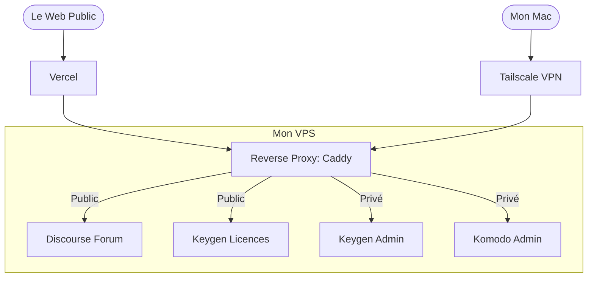

## Introduction

A few weeks ago at the time I am writing this article, I launched into the development of Thence, a macOS application that memorizes a developer's project context to save them time and energy when they resume it after a break.

The code of the application as such is only the tip of the iceberg. Very quickly, the reality of the field catches up with you: to make a product live, you need an entire ecosystem around it. A space for the community, a software license management system, and internal tools to pilot everything and make the right decisions for the evolution of the product.

If we turn to SaaS of all kinds, each specialized in one task in particular, with the versatility of the necessary systems, you quickly end up with a salty bill. Being a student at that time, and having much better projects for my money, I took a radical decision: self-host as much as possible.

In this article, I propose to go through the architecture of my VPS (Virtual Private Server). We will see how I managed to make public and private tools coexist on one and the same machine, the technical choices behind each brick and how this "system D" approach allowed me to build a reliable, scalable and available architecture, for not too expensive.

## The specifications: Exploit Open Source

The objective was not to host services for the pleasure of testing them, but bel and bien to respond to a real business need for Thence. For each need I searched and selected the best free solution, self-hostable in the best of cases, capable of running efficiently in Docker containers, without however making me collapse under technical debt.

### Distribution and licenses: Keygen

For a paid desktop application, software license management is the nerve of the war. I needed a system capable of generating keys, managing activations and ensuring that a user does not deploy the application on 10 different machines with a single subscription. I deployed the self-hosted version of Keygen for that.

### Support and community: Discourse

Rather than opening a Discord server difficultly indexable by Google, or managing a quantity of support client emails intractable and visible only by me, I chose Discourse. It is a forum, exposed on the Internet, which allows me to structure discussions with users, publish roadmaps, exchange with the community around the application in a general way.

More precisely, I use it for several things at the same time:
* **Pre-register users:** It is by inviting them to this forum in a dedicated group that I was able to find the beta users of the application, those with whom I am building the MVP (Minimum Viable Product), still at the moment I am writing the article.
* **Create a public knowledge base self-fueled by users:** This is the second strong point of this kind of tool. People ask questions, I answer them, and other people who ask themselves the same questions read the discussions to find their answers. It is a self-fueled FAQ that responds to the questions of the users directly, and not to the questions that I think the users are going to ask themselves.

### Deployment and monitoring: Komodo

Deploying applications galore in Docker containers is good. But being able to do it graphically, monitor their health state, perform their updates in a few clicks is better! Not that typing commands by hand annoys me particularly, on the contrary, but it is especially tiring, longer. This is where Komodo intervenes, my control center to pilot the vast majority of my self-hosted applications serenely.

---

## The core of the problem: making public and private coexist

You will have perhaps noticed it, I spoke of services accessible to the public like Discourse, but also of services that must imperatively remain private like Komodo or Keygen. This is why a good cloisonnement of the two (public and private) is needed so as not to expose me, myself and the data of the users, to obvious and important flaws.

Here is how I secured and organized this traffic.

### Who orchestrates the traffic? The duo Vercel and Caddy

One of the challenges when making several services cohabit on a single server is the management of traffic and SSL certificates (HTTPS). In my architecture, I set up a cascading proxy system.

#### The Public traffic: Vercel in first line, Caddy at the switching

For everything that is accessible by users (like the Discourse forum) the path is the following:

Vercel handles the entry. My public domain names point to Vercel. It is its infrastructure that takes the connection first. Vercel handles the public SSL certificate, ensures that the connection is secure, then cleanly redirects the traffic to the IP of my VPS.

Once the request arrives on my VPS, it is Caddy that takes the relay. It inspects the subdomain received: if the request targets `forum.thence.app`, Caddy sends it to the Discourse container.

This approach allows me to benefit from the power and security of Vercel in frontal, while keeping total flexibility on my VPS thanks to Caddy to dispatch the traffic to my different Docker containers.

#### The Private traffic: The Caddy + Tailscale safe

For services that never need to be exposed on the public Web (like my Komodo administration interface), I applied the principle of Zero Trust by combining Caddy and Tailscale. Out of the question that these flows pass through the Internet or through Vercel.

Tailscale is a secure mesh VPN based on the WireGuard protocol. By installing Tailscale on my VPS and on my computers, my server obtains a unique private IP address within my secure network (my tailnet), as well as a private domain name.

Here, Caddy adopts a totally different behavior:
* I ask it to listen only on the private network interface of Tailscale for these sensitive services.
* Caddy will directly ask for an SSL certificate from the local Tailscale daemon to secure access in HTTPS.

#### The result

If a user or a robot tries to type the URL of my Komodo from the public Web, he runs into a wall: the domain does not exist and the port is closed. For me to be able to administer my infrastructure, I must obligatorily activate Tailscale on my computer. As soon as I am part of the private network, Caddy recognizes my machine, validates the Tailscale HTTPS, and gives me access to my private containers.

---

## Overview: How it runs day-to-day?

To completely understand how all these bricks cohabit without stepping on each other's feet, nothing beats a good diagram.

---

## The monitoring and the backups

An infrastructure is only viable if it is monitored and backed up.

* **The administration:** This is where Komodo takes all its meaning. Since my PC (via Tailscale), I have access to a dashboard that allows me to see the health state of each container, to consult the logs in one click and to restart a service if necessary.

* **The Backup strategy:** The trap of self-hosting is to lose everything if the server crashes. I have therefore automated the backup of Docker volumes. Each night, a script encrypts these data and sends them to an S3 compatible object storage.

---

## The costs in all that

* For the server itself, I went through OVH, it is quite reliable and not too expensive. I pay around **10.20€ per month**.

* For the public domain name of Thence, I went through Vercel, with which I host the website. I pay 14.99€ per year.**.

* For the S3 storage, I have 1 To with the premium plan of Next.ink, a French and independent tech journal. I pay 8€ per month.**.

That makes a total of 33.19€ per month, it is a quite low amount for the resource I have with that. It will take a lot of traffic on Thence to arrive at saturation, and at that moment, I do not believe that the financial side will be a real break.

On this, thank you for having read until here and to the next one in another article.

**Mathéo G**