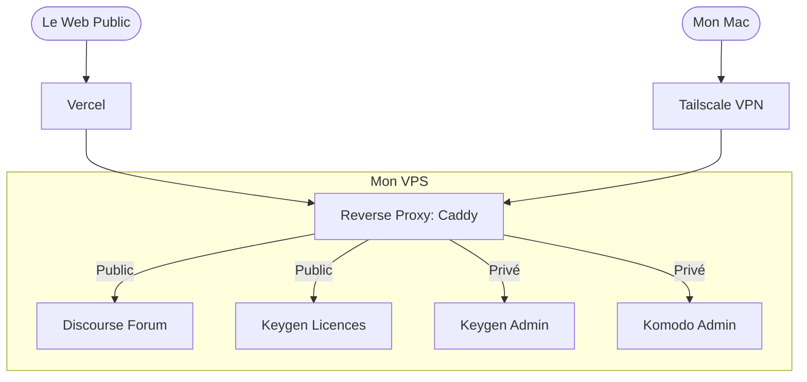

## Introduction

Il y a quelques semaines au moment où j'écris cet article, je me suis lancé dans le développement de Thence, une application macOS qui mémorise le contexte projet d'un développeur pour lui faire gagner du temps et de l'énergie quand il le reprend après une pause.

Le code de l'application en tant que tel n'est que la partie émergée de l'iceberg. Très vite, la réalité du terrain vous rattrape : pour faire vivre un produit, il faut tout un écosystème autour. Un espace pour la communauté, un système de gestion des licences logicielles, et des outils internes pour piloter le tout et prendre les bonnes décisions pour l'évolution du produit. 

Si on se tourne vers des SaaS en tout genre, chacun spécialiste d'une tâche en particulier, avec la polyvalence des systèmes nécessaires, on a vite fait de se retrouver avec une facture salée. Étant étudiant à ce moment-là, et ayant de bien meilleurs projets pour mon argent, j'ai pris une décision radicale : auto-héberger au maximum.

Dans cet article, je vous propose de parcourir l'architecture de mon VPS (Serveur Virtuel Privé). Nous verrons comment j'ai réussi à faire coexister des outils publics et privés sur une seule et même machine, les choix techniques derrière chaque brique et comment cette approche "système D" m'a permis de construire une architecture fiable, scalable et disponible, pour pas trop cher.

## Le cahier des charges : Exploiter l'Open Source

L'objectif n'était pas d'héberger des services pour le plaisir de les tester, mais bel et bien de répondre à un vrai besoin métier pour Thence. Pour chaque besoin, j'ai cherché et sélectionné la meilleure solution gratuite, auto-hébergeable dans le meilleur des cas, capable de tourner efficacement dans des conteneurs Docker, sans pour autant me faire crouler sous la dette technique.

### Distribution et licences : Keygen

Pour une application de bureau payante, la gestion des licences logicielles est le nerf de la guerre. Il me fallait un système capable de générer des clés, de gérer les activations et de s'assurer qu'un utilisateur ne déploie pas l'application sur 10 machines différentes avec un seul abonnement. J'ai déployé la version auto-hébergée de Keygen pour cela. 

### Support et communauté : Discourse

Plutôt que d'ouvrir un serveur Discord difficilement indexable par Google, ou de gérer une quantité de mails de support client intraitable et visible uniquement par moi, j'ai choisi Discourse. C'est un forum, exposé sur Internet, qui me permet de structurer les discussions avec les utilisateurs, de publier les roadmaps, d'échanger avec la communauté autour de l'application de manière générale.

Plus précisément, je l'utilise pour plusieurs choses à la fois :
* **Préinscrire les utilisateurs :** C'est en les invitant sur ce forum dans un groupe dédié que j'ai pu trouver les bêta-utilisateurs de l'application, ceux avec qui je construis le MVP (Produit Minimum Viable), encore au moment où j'écris l'article. 
* **Créer une base de connaissances publique auto-alimentée par les utilisateurs :** C'est le deuxième point fort de ce genre d'outil. Les gens posent des questions, j'y réponds, et d'autres personnes qui se posent les mêmes questions lisent les discussions pour y trouver leurs réponses. C'est une FAQ auto-alimentée qui répond aux questions des utilisateurs directement, et non aux questions que je pense que les utilisateurs vont se poser.

### Déploiement et monitoring : Komodo

Déployer des applications à gogo dans des conteneurs Docker, c'est bien. Mais pouvoir le faire graphiquement, surveiller leur état de santé, effectuer leurs mises à jour en quelques clics, c'est mieux ! Non pas que taper les commandes à la main m'agace particulièrement, au contraire, mais c'est surtout fatiguant, plus long. C'est là que Komodo intervient, mon centre de contrôle pour piloter la grande majorité de mes applications auto-hébergées sereinement.

---

## Le cœur du problème : faire coexister public et privé

Vous l'aurez peut-être remarqué, j'ai parlé de services accessibles au public comme Discourse, mais aussi de services qui doivent impérativement rester privés comme Komodo ou Keygen. C'est pourquoi il faut un bon cloisonnement des deux (public et privé) de sorte à ne pas m'exposer, moi et les données des utilisateurs, à des failles évidentes et importantes.

Voici comment j'ai sécurisé et organisé ce trafic.

### Qui orchestre le trafic ? Le duo Vercel et Caddy

L'un des défis quand on fait cohabiter plusieurs services sur un seul serveur, c'est la gestion du trafic et des certificats SSL (le HTTPS). Dans mon architecture, j'ai mis en place un système de proxy en cascade.

#### Le trafic Public : Vercel en première ligne, Caddy à l'aiguillage

Pour tout ce qui est accessible par les utilisateurs (comme le forum Discourse), le chemin est le suivant :

Vercel gère l'entrée. Mes noms de domaine publics pointent vers Vercel. C'est son infrastructure qui encaisse la connexion en premier. Vercel gère le certificat SSL public, s'assure que la connexion est sécurisée, puis redirige proprement le trafic vers l'IP de mon VPS.

Une fois la requête arrivée sur mon VPS, c'est Caddy qui prend le relais. Il inspecte le sous-domaine reçu : si la requête cible `forum.thence.app`, Caddy la renvoie vers le conteneur Discourse.

Cette approche me permet de bénéficier de la puissance et de la sécurité de Vercel en frontal, tout en gardant une flexibilité totale sur mon VPS grâce à Caddy pour dispatcher le trafic vers mes différents conteneurs Docker.

#### Le trafic Privé : Le coffre-fort Caddy + Tailscale

Pour les services qui n'ont jamais besoin d'être exposés sur le Web public (comme mon interface d'administration Komodo), j'ai appliqué le principe du *Zero Trust* en combinant Caddy et Tailscale. Hors de question que ces flux passent par Internet ou par Vercel.

Tailscale est un VPN maillé sécurisé basé sur le protocole WireGuard. En installant Tailscale sur mon VPS et sur mes ordinateurs, mon serveur obtient une adresse IP privée unique au sein de mon réseau sécurisé (mon *tailnet*), ainsi qu'un nom de domaine privé.

Ici, Caddy adopte un comportement totalement différent :
* Je lui demande d'écouter uniquement sur l'interface réseau privée de Tailscale pour ces services sensibles.
* Caddy va directement demander un certificat SSL au démon Tailscale local pour sécuriser l'accès en HTTPS.

#### Le résultat

Si un utilisateur ou un robot tente de taper l'URL de mon Komodo depuis le Web public, il se heurte à un mur : le domaine n'existe pas et le port est fermé. Pour que je puisse administrer mon infrastructure, je dois obligatoirement activer Tailscale sur mon ordinateur. Dès que je fais partie du réseau privé, Caddy reconnaît ma machine, valide le HTTPS Tailscale, et me donne accès à mes conteneurs privés.

---

## Vue d'ensemble : Comment ça tourne au quotidien ?

Pour bien comprendre comment toutes ces briques cohabitent sans se marcher sur les pieds, rien ne vaut un bon schéma.

---

## Le Monitoring et les Sauvegardes

Une infrastructure n'est viable que si elle est surveillée et sauvegardée.

* **L'administration :** C'est là que Komodo prend tout son sens. Depuis mon PC (via Tailscale), j'ai accès à un tableau de bord qui me permet de voir l'état de santé de chaque conteneur, de consulter les logs en un clic et de redémarrer un service si nécessaire.

* **La stratégie de Backup :** Le piège du *self-hosting*, c'est de tout perdre si le serveur crash. J'ai donc automatisé la sauvegarde des volumes Docker. Chaque nuit, un script chiffre ces données et les envoie vers un stockage objet compatible S3.

---

## Les coûts dans tout ça

* Pour le serveur lui-même, je suis passé par OVH, c'est assez fiable et pas trop cher. Je paye environ **10.20€ par mois**.

* Pour le nom de domaine public de Thence, je suis passé par Vercel, ce avec quoi j'héberge le site Web. Je paye **14.99€ par an**.

* Pour le stockage S3, je dispose d'1 To avec le plan premium de Next.ink, un journal tech français et indépendant. Je paye **8€ par mois**.

Cela fait un total de **33.19€ par mois**, c'est un montant assez faible pour la ressource que j'ai avec cela. Il va falloir beaucoup de trafic sur Thence pour arriver à saturation, et à ce moment-là, je ne crois pas que le côté financier soit un vrai frein.

Sur ce, merci d'avoir lu jusqu'ici et à la prochaine dans un autre article.

**Mathéo G**