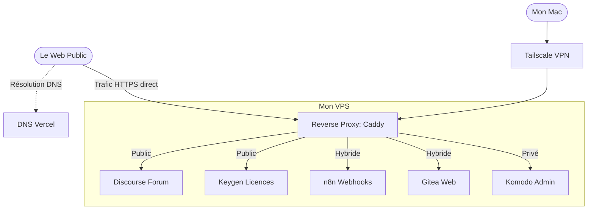

## Introduction

Il y a quelques semaines au moment où j'écris cet article, je me suis lancé dans le développement de Thence, une application macOS qui mémorise le contexte projet d'un développeur pour lui faire gagner du temps et de l'énergie quand il le reprend après une pause.

Le code de l'application en tant que tel n'est que la partie émergée de l'iceberg. Très vite, la réalité du terrain vous rattrape : pour faire vivre un produit, il faut tout un écosystème autour. Un espace pour la communauté, un système de gestion des licences logicielles, et des outils internes pour piloter le tout et prendre les bonnes décisions pour l'évolution du produit.

Si on se tourne vers des SaaS en tout genre, chacun spécialiste d'une tâche en particulier, avec la polyvalence des systèmes nécessaires, on a vite fait de se retrouver avec une facture salée. Étant étudiant à ce moment-là, et ayant de bien meilleurs projets pour mon argent, j'ai pris une décision radicale : auto-héberger au maximum.

Dans cet article, je vous propose de parcourir l'architecture de mon VPS (Serveur Virtuel Privé). Nous verrons comment j'ai réussi à faire coexister des outils publics et privés sur une seule et même machine, les choix techniques derrière chaque brique et comment cette approche "système D" m'a permis de construire une architecture fiable, scalable et disponible, pour pas trop cher.

## Le cahier des charges : Exploiter l'Open Source

L'objectif n'était pas d'héberger des services pour le plaisir de les tester, mais bel et bien de répondre à un vrai besoin métier pour Thence. Pour chaque besoin, j'ai cherché et sélectionné la meilleure solution gratuite, auto-hébergeable dans le meilleur des cas, capable de tourner efficacement dans des conteneurs Docker, sans pour autant me faire crouler sous la dette technique.

### Hébergement du code : Gitea

Au revoir GitHub ou GitLab, je voulais garder la souveraineté de mon code et gérer mes propres runners CI/CD. Gitea est léger et fait l'affaire, il s'imposait donc comme une évidence.

### Automatisation : n8n

Pour gérer les flux RSS de mon blog et ma newsletter, il me fallait un chef d'orchestre. J'avais envie de tester n8n depuis un moment, c'était l'occasion rêvée !

### Distribution et licences : Keygen

Pour une application de bureau payante, la gestion des licences logicielles est le nerf de la guerre. Il me fallait un système capable de générer des clés, de gérer les activations et de s'assurer qu'un utilisateur ne déploie pas l'application sur 10 machines différentes avec un seul abonnement. J'ai déployé la version auto-hébergée de Keygen pour cela.

### Support et communauté : Discourse

Plutôt que d'ouvrir un serveur Discord difficilement indexable par Google, ou de gérer une quantité de mails de support client intraitable et visible uniquement par moi, j'ai choisi Discourse. C'est un forum, exposé sur Internet, qui me permet de structurer les discussions avec les utilisateurs, de publier les roadmaps, d'échanger avec la communauté autour de l'application de manière générale.

Plus précisément, je l'utilise pour plusieurs choses à la fois :

* **Préinscrire les utilisateurs :** C'est en les invitant sur ce forum dans un groupe dédié que j'ai pu trouver les bêta-utilisateurs de l'application, ceux avec qui je construis le MVP (Produit Minimum Viable), encore au moment où j'écris l'article.

* **Créer une base de connaissances publique auto-alimentée par les utilisateurs :** C'est le deuxième point fort de ce genre d'outil. Les gens posent des questions, j'y réponds, et d'autres personnes qui se posent les mêmes questions lisent les discussions pour y trouver leurs réponses. C'est une FAQ auto-alimentée qui répond aux questions des utilisateurs directement, et non aux questions que je pense que les utilisateurs vont se poser.

### Déploiement et monitoring : Komodo

Déployer des applications à gogo dans des conteneurs Docker, c'est bien. Mais pouvoir le faire graphiquement, surveiller leur état de santé, effectuer leurs mises à jour en quelques clics, c'est mieux ! Non pas que taper les commandes à la main m'agace particulièrement, au contraire, mais c'est surtout fatigant, plus long. C'est là que Komodo intervient, mon centre de contrôle pour piloter la grande majorité de mes applications auto-hébergées sereinement.

---

## Le cœur du problème : faire coexister public et privé

Vous l'aurez peut-être remarqué, j'ai parlé de services accessibles au public comme Discourse, mais aussi de services qui doivent impérativement rester privés comme Komodo ou Keygen. C'est pourquoi il faut un bon cloisonnement des deux (public et privé) de sorte à ne pas m'exposer, moi et les données des utilisateurs, à des failles évidentes et importantes. 

Voici comment j'ai sécurisé et organisé ce trafic.

### Qui orchestre le trafic ? Le duo Vercel et Caddy

L'un des défis quand on fait cohabiter plusieurs services sur un seul serveur, c'est la gestion du trafic et des certificats SSL (le HTTPS). Dans mon architecture, j'ai mis en place un système de proxy en cascade.

#### Le trafic Public : Vercel au DNS, Caddy à l'aiguillage

Pour tout ce qui est accessible par les utilisateurs (comme le forum Discourse), l'architecture est la suivante : 

Mon nom de domaine principal est géré chez Vercel. J'y ai déclaré un enregistrement de type A pour les sous-domaines publics (par exemple forum.thence.app) qui pointent vers l'IP publique de mon VPS.

C'est donc mon VPS qui reçoit la connexion. Une fois la requête arrivée, c'est Caddy qui prend le relais. J'ai choisi Caddy, entre autres, pour sa fonctionnalité native d'Automatic HTTPS. Il fournit et renouvelle automatiquement les certificats SSL sans intervention de ma part. 

Voici un extrait de mon Caddyfile pour le forum :
```
forum.thence.app {
        reverse_proxy 127.0.0.1:9080 {
                header_up Host {host}
                header_up X-Real-IP {remote_host}
                header_up X-Forwarded-For {remote_host}
                header_up X-Forwarded-Proto {scheme}
                header_up X-Forwarded-Host {host}
        }

        encode gzip zstd
}
```

Aucune mention de certificat à gérer, Caddy lit la requête, gère le HTTPS, transmet les bonnes en-têtes pour que l'application conserve l'IP d'origine et redirige le flux vers le port local de mon conteneur Discourse.

#### Le trafic Privé : Le coffre-fort Caddy + Tailscale

Pour les services qui n'ont jamais besoin d'être exposés sur le Web public (comme mon interface d'administration Komodo), j'ai appliqué le principe du Zero Trust en combinant Caddy et Tailscale. Hors de question que ces flux passent par Internet ou par Vercel.

Tailscale est un VPN maillé sécurisé basé sur le protocole WireGuard. En installant Tailscale sur mon VPS et sur mes ordinateurs, mon serveur obtient une adresse IP privée unique au sein de mon réseau sécurisé (mon tailnet).

Pour ces services, la configuration de Caddy adopte une approche totalement fermée :
```
vps-939ea86a.tail8644df.ts.net {
    tls /etc/caddy/certs/cert.crt /etc/caddy/certs/cert.key
    reverse_proxy 127.0.0.1:9120
}
```

Ce bloc ne répondra jamais à une requête sur Internet. Il n'écoute que sur le domaine privé fourni par Tailscale et utilise des certificats générés localement. Si un robot scanne l'IP publique de mon serveur, il ne trouvera absolument rien. Pour accéder à mon interface d'administration (ici sur le port local 9120), je dois obligatoirement activer Tailscale sur mon ordinateur.

#### Les cas hybrides : le meilleur des deux mondes
##### Filtrer par route HTTP (L'exemple n8n)

Parfois, un service doit être partiellement public pour recevoir des données, mais son interface d'administration doit rester strictement inaccessible. C'est le cas de mon instance n8n qui doit pouvoir recevoir des webhooks de l'extérieur.

Voici comment je sécurise ce flux :
```
n8n.thence.app {
        @preflight {
                method OPTIONS
                path /webhook/*
        }

        handle @preflight {
                header Access-Control-Allow-Origin "https://thence.app"
                header Access-Control-Allow-Methods "GET, POST, OPTIONS"
                header Access-Control-Allow-Headers "Content-Type, Authorization"
                header Access-Control-Max-Age "86400"
                respond "" 204
        }

        handle /webhook/* {
                header Access-Control-Allow-Origin "https://thence.app"
                header Access-Control-Allow-Methods "GET, POST, OPTIONS"
                header Access-Control-Allow-Headers "Content-Type, Authorization"

                reverse_proxy http://100.127.230.106:5678
        }

        handle {
                respond "Forbidden" 403
        }
}
```

Ici, je gère :
* les requêtes CORS "preflight" (`OPTIONS`) pour autoriser mon application principale à communiquer avec l'API
* J'autorise le reverse proxy **uniquement** sur le chemin `/webhook/*`
* Le dernier bloc `handle` agit comme un `else` : toute autre requête se verra retourner une erreur `403 Forbidden`. L'outil peut ainsi travailler sereinement avec l'extérieur sans jamais exposer son back-office

Ici, je gère :
* Les requêtes CORS "preflight" (OPTIONS) pour autoriser mon application principale à communiquer avec l'API
* J'autorise le reverse proxy uniquement sur le chemin /webhook/*
* Le dernier bloc handle agit comme un else : toute autre requête se verra retourner une erreur `403 Forbidden`. L'outil peut ainsi travailler sereinement avec l'extérieur sans jamais exposer son back-office

##### Filtrer par protocole et réseau (L'exemple Gitea)

Pour mon instance Gitea, le besoin hybride est différent. Je veux que l'interface web soit accessible publiquement pour consulter ce que je fais, mais je veux aussi verrouiller les accès en écriture (clone et push).

Pour garder le contrôle sur mon code source, la règle est simple : je désactive le clone en HTTP et je force le SSH uniquement sur le domaine Tailscale. 

Caddy se contente donc d'exposer l'interface web :
```
git.matheoguilbert.fr {
        encode gzip zstd
        reverse_proxy 127.0.0.1:3000
}
```

Et côté Gitea, je désactive le clonage HTTP et spécifie le domaine SSH à utiliser :
```
GITEA__server__DISABLE_HTTP_GIT=true
GITEA__server__SSH_DOMAIN=vps-939ea86a.tail8644df.ts.net
GITEA__server__SSH_PORT=222
```

---

## Vue d'ensemble : Comment ça tourne au quotidien ?

Pour bien comprendre comment toutes ces briques cohabitent sans se marcher sur les pieds, rien ne vaut un bon schéma.



---

## Le Monitoring et les Sauvegardes

Une infrastructure n'est viable que si elle est surveillée et sauvegardée.

* **L'administration :** C'est là que Komodo prend tout son sens. Depuis mon PC (via Tailscale), j'ai accès à un tableau de bord qui me permet de voir l'état de santé de chaque conteneur, de consulter les logs en un clic et de redémarrer un service si nécessaire.

* **La stratégie de Backup :** Le piège du self-hosting, c'est de tout perdre si le serveur crash. Pour éviter cela, j'ai automatisé mes sauvegardes avec Restic, un outil open-source qui chiffre et déduplique nativement les données. Chaque nuit, un script Bash réalise un dump à chaud de mes bases de données (via mongodump), puis Restic sauvegarde directement mes volumes Docker (`/var/lib/docker/volumes`) vers mon stockage S3. Le script inclut même une politique de rétention (`restic forget --keep-daily 7`) pour purger automatiquement les sauvegardes de plus d'une semaine et optimiser les coûts de stockage.

---

## Les coûts dans tout ça

* Pour le serveur lui-même, je suis passé par OVH, c'est assez fiable et pas trop cher. Je paye environ **10.20€ par mois**.

* Pour le nom de domaine public de Thence, je suis passé par Vercel, ce avec quoi j'héberge le site Web. Je paye **14.99€ par an**.

* Pour le stockage S3, je dispose d'1 To avec le plan premium de Next.ink, un journal tech français et indépendant. Je paye **8€ par mois**.

Cela fait un total de 33.19€ par mois, c'est un montant assez faible pour la ressource que j'ai avec cela. Il va falloir beaucoup de trafic sur Thence pour arriver à saturation, et à ce moment-là, je ne crois pas que le côté financier soit un vrai frein.

Sur ce, merci d'avoir lu jusqu'ici et à la prochaine dans un autre article.

**Mathéo G**